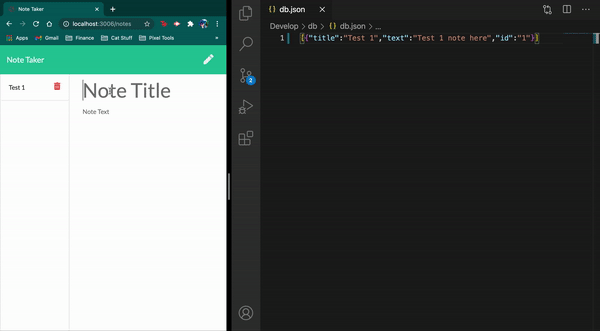

# **Note Taker** - 
    
The **Note Taker** application uses Node.js and Express in order to save a users notes to a backend server deployed on Heroku. This application will use an Express.js back end and will save and retrieve note data from a JSON file.
 
 

    
## Table of Contents
* [Requirements](#Requirements)
* [Usage](#Usage)
* [Demo](#Demo)
* [Contact](#Contact)
* [License](#license)

 
                
## Requirements
This application is dependent on the npm package Express.
 
 
            
## Usage
**Note Taker** requires npm packages to run. Please make sure [node is installed](https://nodejs.org/en/download/) prior to cloning the repo. You can find instructions for installing node on the [node website](https://nodejs.org/en/download/).
* After you're sure node.js has been installed correctly, clone the [Note Taker Repo](https://github.com/xander-deanna/note-taker) locally onto your computer. Instructions on how to clone from Github can be found on [Github Docs](https://docs.github.com/en/github/creating-cloning-and-archiving-repositories/cloning-a-repository).
* Once the repo has been cloned, please navigate to the correct directory using your terminal or other command line application. You'll want to be in the "Develop" folder for this app.
* Next type <code>npm i</code> into the command line and hit <kbd>enter</kbd> to install all dependencies.
 
 

## Demo
Here is a gif to help demonstrate the site's usage:
 

 
 
    
## Contact
Please feel free to contact me with any questions you might have, using the following information:
    
Email: [xander.deanna@gmail.com](mailto:xander.deanna@gmail.com)
 
Github: [https://github.com/xander-deanna](https://github.com/xander-deanna)
 
 

## License
This application was created by **Deanna Alexander** and is covered under the **WTFPL license**.
 
 
